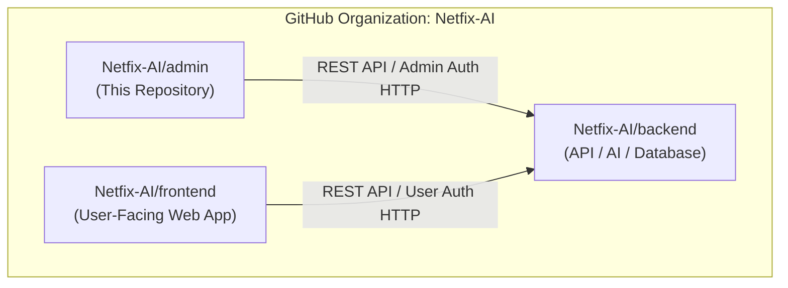
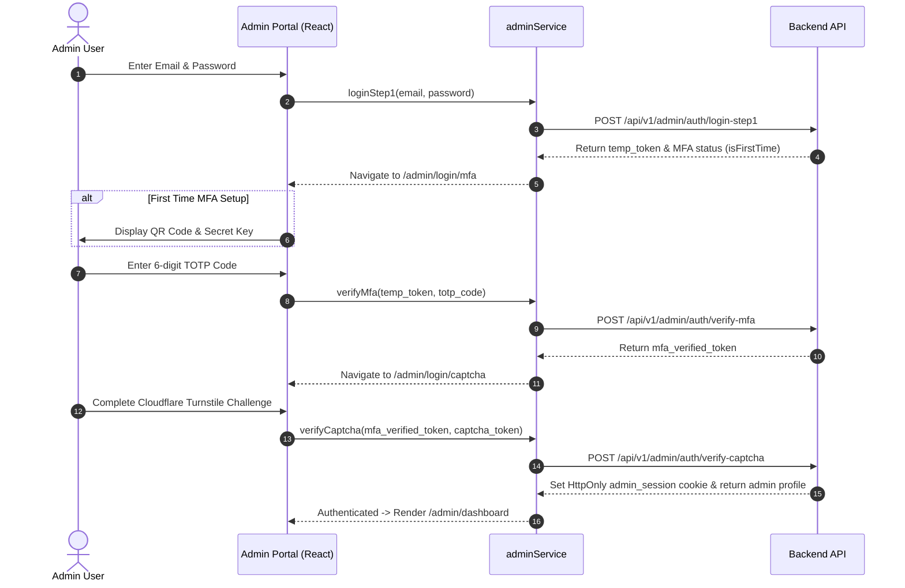

# NETFIX AI — Admin Portal

[](LICENSE)
[](https://react.dev/)
[](https://vitejs.dev/)
[](https://www.typescriptlang.org/)

The **NETFIX AI Admin Portal** is the centralized administrative command center for the NETFIX AI ecosystem (developed in association with MARG GROUP). It provides platform administrators with real-time oversight of AI agents, user governance, access request approvals, immutable audit logging, support ticket management, and system-wide security settings.

---

## 📌 Repository Scope

> [!IMPORTANT]
> This repository contains **ONLY** the user interface and logic for the **NETFIX AI Admin Portal**.
>
> It does **not** contain backend API services, database infrastructure, or the user-facing application frontend.
>
> The corresponding components are maintained in separate, isolated private repositories:
> - **Backend API & AI Engine**: [`Netfix-AI/backend`](https://github.com/Netfix-AI/backend)
> - **User-Facing Frontend**: [`Netfix-AI/frontend`](https://github.com/Netfix-AI/frontend)



---

## 🛠️ Technology Stack

- **Core Framework**: [React 19](https://react.dev/) (`react`, `react-dom`)
- **Build Tooling**: [Vite 6](https://vitejs.dev/) (`vite`, `@vitejs/plugin-react`)
- **Language**: [TypeScript 6](https://www.typescriptlang.org/) (`typescript`, `tsc`)
- **Styling**: [Tailwind CSS 3](https://tailwindcss.com/) (`tailwindcss`, `autoprefixer`, `postcss`)
- **Iconography**: [Lucide React](https://lucide.dev/) (`lucide-react`)
- **MFA Utilities**: [QRCode](https://www.npmjs.com/package/qrcode) (`qrcode`, `@types/qrcode`)
- **Linter**: [Oxlint](https://oxc.rs/docs/guide/usage/linter/rules) (`oxlint`)

---

## 📂 Project Structure

```
admin/
├── public/
│   ├── backend.mp4             # Background video asset for admin portal
│   ├── favicon.svg             # Application favicon
│   └── icons.svg               # SVG icon sprites
├── src/
│   ├── assets/                 # UI image assets and logos
│   ├── components/
│   │   ├── admin/              # Admin-specific view panels and modal controls
│   │   │   ├── AccessRequestsView.tsx
│   │   │   ├── AdminCaptcha.tsx
│   │   │   ├── AdminDashboardView.tsx
│   │   │   ├── AdminHeader.tsx
│   │   │   ├── AdminLogin.tsx
│   │   │   ├── AdminMFA.tsx
│   │   │   ├── AdminOTP.tsx
│   │   │   ├── AdminSidebar.tsx
│   │   │   ├── AgentsView.tsx
│   │   │   ├── AuditTrailView.tsx
│   │   │   ├── ProfileView.tsx
│   │   │   ├── SettingsView.tsx
│   │   │   ├── SupportView.tsx
│   │   │   └── UsersView.tsx
│   │   └── common/             # Shared layout and background styling wrappers
│   │       ├── AdminAuthLayout.tsx
│   │       ├── AdminBackground.tsx
│   │       ├── AdminLogo.tsx
│   │       └── AdminStepIndicator.tsx
│   ├── data/
│   │   └── mockAdminData.ts    # Initial administrative fallback datasets
│   ├── services/
│   │   └── adminService.ts     # Admin authentication & backend API communication
│   ├── types/
│   │   └── index.ts            # Admin TypeScript interface definitions
│   ├── App.css                 # Component-level styling overrides
│   ├── App.tsx                 # Root application component & router controller
│   ├── index.css               # Tailwind CSS directives & global dark theme variables
│   └── main.tsx                # Application entry point DOM mount
├── .env.example                # Safe environment variable configuration template
├── .gitignore                  # Git exclusion configuration
├── index.html                  # HTML entry point document
├── package.json                # Project dependencies and script declarations
├── postcss.config.js           # PostCSS build pipeline configuration
├── tailwind.config.js          # Tailwind CSS theme extension configuration
├── tsconfig.json               # Root TypeScript configuration
├── tsconfig.app.json           # Application TypeScript compilation settings
├── tsconfig.node.json          # Node environment TypeScript settings
└── vite.config.ts              # Vite bundling & development server settings
```

---

## 📁 Folder-by-Folder Explanation

- **`src/components/admin/`**: Contains view components rendered inside the protected admin workspace. Each component handles a dedicated section of the admin dashboard (e.g., user management, agent monitoring, audit trail).
- **`src/components/common/`**: Reusable layout wrappers providing the dark visual design language, animated backgrounds, logo branding, and multi-step auth indicators.
- **`src/data/`**: Fallback and seed data used for local interface state management when developing offline.
- **`src/services/`**: Encapsulates HTTP API communication with the backend service (`adminAuthService`), managing login steps, MFA validation, session checking, and cookie management.
- **`src/types/`**: Holds TypeScript interfaces representing admin users, access requests, AI task logs, audit events, support tickets, and navigation tabs.

---

## 📄 Important Files

| File | Purpose | Used By | Responsibility |
|------|---------|---------|----------------|
| [`src/App.tsx`](file:///d:/TEJA%20PERSONAL/Nushift/Project%20M/Project/admin/src/App.tsx) | Root Component & Router | `main.tsx` | Manages 3-step auth state, session checking, tab navigation, and top-level layout rendering |
| [`src/services/adminService.ts`](file:///d:/TEJA%20PERSONAL/Nushift/Project%20M/Project/admin/src/services/adminService.ts) | Admin Auth Service | `App.tsx`, Auth steps | Handles HTTP requests for Step-1 password verification, Step-2 MFA, Step-3 Captcha, and logout |
| [`src/components/admin/AdminLogin.tsx`](file:///d:/TEJA%20PERSONAL/Nushift/Project%20M/Project/admin/src/components/admin/AdminLogin.tsx) | Step 1 Auth UI | `App.tsx` | Captures email & password credentials and initiates administrative verification |
| [`src/components/admin/AdminMFA.tsx`](file:///d:/TEJA%20PERSONAL/Nushift/Project%20M/Project/admin/src/components/admin/AdminMFA.tsx) | Step 2 Auth UI | `App.tsx` | Renders TOTP QR code setup for first-time admins and verifies 6-digit TOTP codes |
| [`src/components/admin/AdminCaptcha.tsx`](file:///d:/TEJA%20PERSONAL/Nushift/Project%20M/Project/admin/src/components/admin/AdminCaptcha.tsx) | Step 3 Auth UI | `App.tsx` | Integrates Cloudflare Turnstile challenge before establishing HttpOnly admin session |
| [`src/components/admin/AdminDashboardView.tsx`](file:///d:/TEJA%20PERSONAL/Nushift/Project%20M/Project/admin/src/components/admin/AdminDashboardView.tsx) | Admin Overview | `App.tsx` | Displays high-level platform health metrics, active users, AI execution counts, and quick actions |
| [`src/components/admin/UsersView.tsx`](file:///d:/TEJA%20PERSONAL/Nushift/Project%20M/Project/admin/src/components/admin/UsersView.tsx) | User Management View | `App.tsx` | Provides user table filtering, account suspension/reactivation controls, and detailed user inspection |
| [`src/components/admin/AgentsView.tsx`](file:///d:/TEJA%20PERSONAL/Nushift/Project%20M/Project/admin/src/components/admin/AgentsView.tsx) | AI Agent Control View | `App.tsx` | Monitors live AI agent activity, worker pool status, task completion stats, and model configurations |
| [`src/components/admin/AccessRequestsView.tsx`](file:///d:/TEJA%20PERSONAL/Nushift/Project%20M/Project/admin/src/components/admin/AccessRequestsView.tsx) | Access Request Manager | `App.tsx` | Allows admins to review and approve/reject elevated role access requests |
| [`src/components/admin/AuditTrailView.tsx`](file:///d:/TEJA%20PERSONAL/Nushift/Project%20M/Project/admin/src/components/admin/AuditTrailView.tsx) | Immutable Audit Log | `App.tsx` | Renders filterable system audit trail events logged across the NETFIX AI ecosystem |

---

## 🗺️ Admin Pages & Routes

The Admin Portal uses browser history navigation (`pushState`) mapped to internal view states:

| Path | View | Access Level | Description |
|------|------|--------------|-------------|
| `/admin/login` | `AdminLogin` | Public / Unauthenticated | Step 1: Administrator email & password authentication |
| `/admin/login/mfa` | `AdminMFA` | Unauthenticated (Step 1 Token) | Step 2: Multi-Factor Authentication (TOTP / QR code setup) |
| `/admin/login/captcha` | `AdminCaptcha` | Unauthenticated (Step 2 Token) | Step 3: Cloudflare Turnstile bot protection challenge |
| `/admin/dashboard` | `AdminDashboardView` | Authenticated Admin | System status, user counts, AI performance metrics |
| `/admin/users` | `UsersView` | Authenticated Admin | User directory, role assignment, status toggling |
| `/admin/agents` | `AgentsView` | Authenticated Admin | AI worker agents oversight, execution stats, task history |
| `/admin/access-requests` | `AccessRequestsView` | Authenticated Admin | Governance approvals for pending role elevation requests |
| `/admin/audit` | `AuditTrailView` | Authenticated Admin | Security audit trail, user actions, system security events |
| `/admin/support` | `SupportView` | Authenticated Admin | Internal support tickets and system help desk |
| `/admin/profile` | `ProfileView` | Authenticated Admin | Administrator profile, credentials management |
| `/admin/settings` | `SettingsView` | Authenticated Admin | System-wide governance policy and feature toggles |

---

## 🔐 Multi-Step Admin Authentication Architecture

The Admin Portal implements a **3-Step Security Authentication Protocol** to prevent unauthorized administrative access:



---

## 🔌 Backend Communication

The Admin Portal communicates with the backend REST API via `http://localhost:5000/api/v1/admin`.

Key API contracts used by `adminAuthService`:
- `POST /api/v1/admin/auth/login-step1`: Primary credential validation.
- `POST /api/v1/admin/auth/verify-mfa`: TOTP code verification.
- `POST /api/v1/admin/auth/verify-captcha`: Turnstile verification & session cookie issuance.
- `GET /api/v1/admin/auth/session`: Validates active `HttpOnly` `admin_session` cookie.
- `POST /api/v1/admin/auth/logout`: Clears backend session cookie.
- `GET /api/v1/admin/dashboard-stats`: Retrieves live platform telemetry.
- `GET /api/v1/admin/users`: Retrieves user account listings.
- `GET /api/v1/admin/agents`: Retrieves worker agent metrics and active tasks.
- `GET /api/v1/admin/audit-logs`: Fetches security audit logs.

---

## 🔑 Environment Variables

Create a local `.env` file based on `.env.example`:

```env
# Netfix AI Admin API Endpoint & Turnstile Configuration
VITE_API_URL=http://localhost:5000/api/v1
VITE_TURNSTILE_SITE_KEY=your_cloudflare_turnstile_site_key
```

> [!WARNING]
> Never commit actual secret keys or credentials to Git. `.env` is explicitly ignored in `.gitignore`.

---

## 🚀 Local Development Setup

### Prerequisites
- **Node.js**: `v18.0.0` or higher
- **npm**: `v9.0.0` or higher

### Installation & Execution

1. Navigate to the `admin` folder:
   ```bash
   cd admin
   ```

2. Install dependencies:
   ```bash
   npm install
   ```

3. Start the Vite development server:
   ```bash
   npm run dev
   ```
   The application will be available at `http://localhost:3001` (or Vite assigned port).

---

## 🏗️ Build & Linting Commands

| Command | Action | Description |
|---------|--------|-------------|
| `npm run dev` | Development Server | Starts Vite dev server with hot module replacement (HMR) |
| `npm run build` | Production Build | Runs TypeScript type checking (`tsc -b`) and builds production bundle |
| `npm run lint` | Code Inspection | Executes `oxlint` to enforce code quality and React hook rules |
| `npm run preview` | Preview Build | Serves the compiled `dist/` production build locally |

---

## 🛡️ Security Notes

1. **HttpOnly Cookie Handling**: Session tokens are maintained via `HttpOnly` and `SameSite` cookies configured by the backend API to prevent XSS credential theft.
2. **Role Boundaries**: Admin credentials grant platform governance permissions; they do not bypass tenant data isolation enforced by backend RBAC.
3. **MFA Verification**: Mandatory TOTP verification is enforced for all administrative access.

---

## ❓ Troubleshooting

- **CORS Error on Auth Requests**: Verify that the backend `.env` includes `ADMIN_URL=http://localhost:3001` in allowed origins.
- **Turnstile Widget Failure**: Check that `VITE_TURNSTILE_SITE_KEY` is specified in your `.env` file or test mode key (`1x00000000000000000000AA`) is active.
- **Session Expiry**: Admin session cookies expire automatically based on server JWT policy. Re-authenticate via `/admin/login`.
