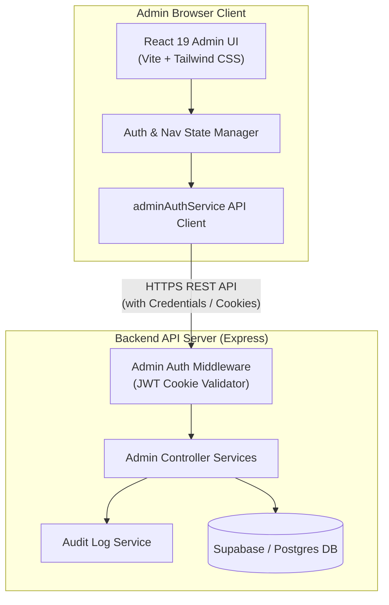
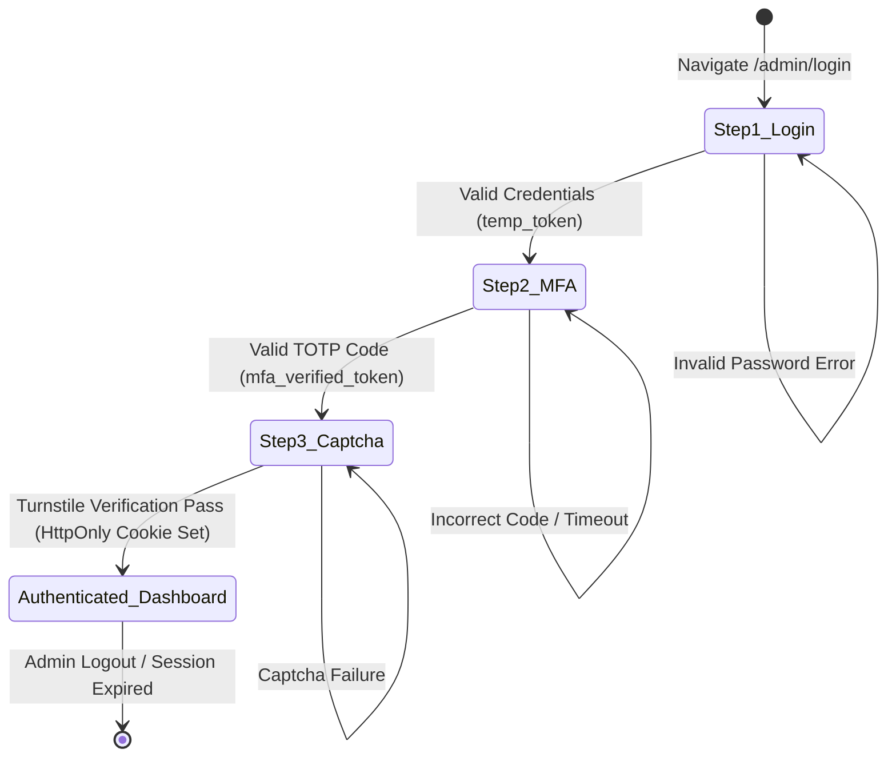
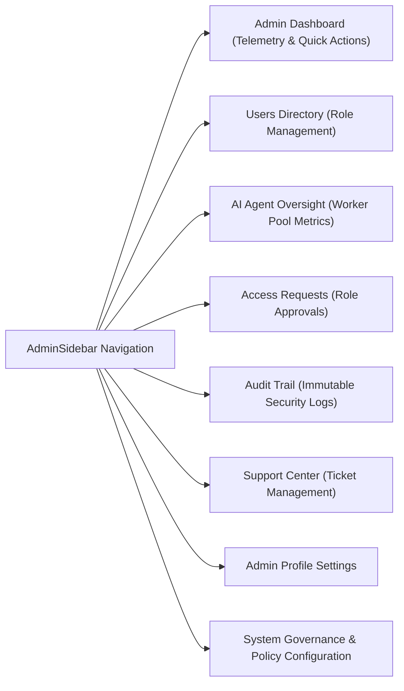

# NETFIX AI — Admin Portal Architecture & Visual Guides

This document outlines the architecture, layout hierarchy, and authentication flow for the **NETFIX AI Admin Portal**.

---

## 🏛️ System Architecture

---

## 🔒 3-Step Admin Authentication Lifecycle

---

## 🧭 Admin Dashboard View Layout Matrix

